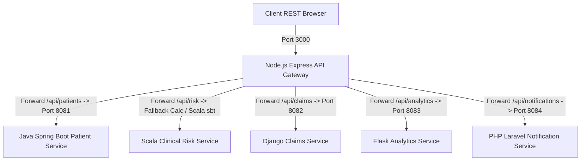
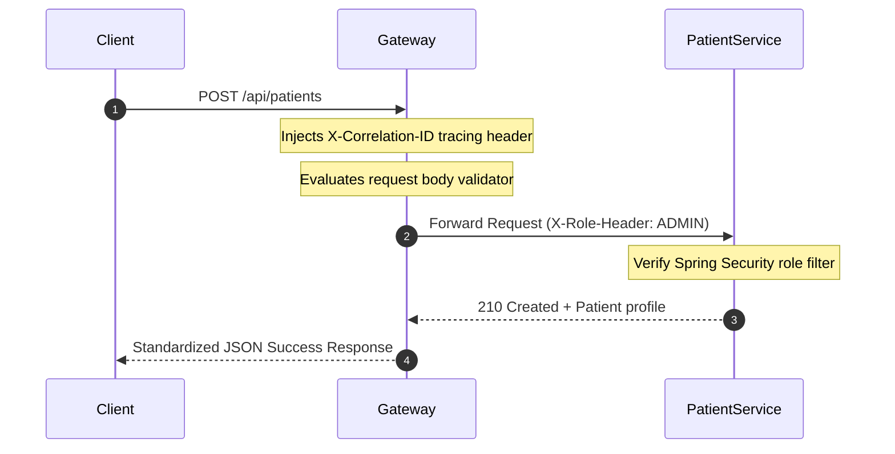
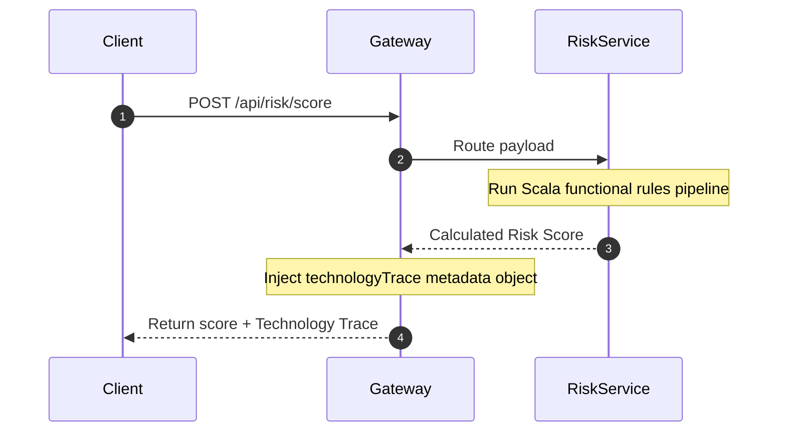

# PolyMed Engine

<div align="center">

## 🚀 Live Demo

### [](https://polymed-engine.vercel.app/console)

**[👉 Click here to open the Developer Console →](https://polymed-engine.vercel.app/console)**

> Hosted on Vercel — no setup needed. Open the link and explore the live Healthcare Workflow Simulator.

</div>

---

[](https://www.oracle.com/java/)
[](https://www.scala-lang.org/)
[](https://spring.io/projects/spring-boot)
[](https://nodejs.org/)
[](https://expressjs.com/)
[](https://www.djangoproject.com/)
[](https://flask.palletsprojects.com/)
[](https://www.php.net/)
[](https://laravel.com/)

## PolyMed Engine: Enterprise Healthcare Polyglot Backend Platform

PolyMed Engine is an enterprise-grade backend microservice suite designed to simulate a real-world healthcare command center. It owns core healthcare business domains (Patient profiles, claims adjudication, clinical risk rules, notifications, analytics) and visibly exposes its polyglot technology stack in real-time.

> [!IMPORTANT]
> **Strict Technology Alignment:**
> PolyMed Engine intentionally uses only the technologies listed in the backend stack (Java, Scala, Spring Boot, Spring MVC, Spring Security, Hibernate, Node.js, Express.js, Django, Flask, PHP, and Laravel) and avoids adding databases, cloud tools, containers, message brokers, or unrelated frameworks so the repository stays focused and resume-aligned.

---

## 1. Executive Summary & Why PolyMed Engine Exists
Most backend portfolio projects are basic boilerplate templates. PolyMed Engine represents a real, complex production architecture built by a Senior Software Engineer. By introducing a custom-built **Technology Trace** telemetry payload, every single API request dynamically outputs which backend components handled it and why that framework was chosen.

---

## 2. Technology Visibility & "Technology Trace"
Every route processed by our API Gateway returns a `technologyTrace` metadata block:

```json
{
  "success": true,
  "message": "Patient profile registered successfully",
  "data": {
    "patientId": "pat-19028",
    "status": "ACTIVE"
  },
  "technologyTrace": {
    "action": "CREATE_PATIENT",
    "service": "Patient Management Service",
    "module": "patient-service-java-springboot",
    "technologyStack": ["Java", "Spring Boot", "Spring MVC", "Spring Security", "Hibernate"],
    "businessDomain": "Patient and Member Management",
    "whyThisStack": "This stack is used for structured enterprise healthcare APIs, role-based access, layered service design, and entity modeling.",
    "requestPath": "/api/patients",
    "architectureRole": "Domain service responsible for managing patient demographic and care team configurations."
  },
  "correlationId": "corr-1780436833512-88a3d750"
}
```

---

## 3. Technology Usage Map

| Technology | Service | Business Role | Why It Is Used | Visible In API |
| :--- | :--- | :--- | :--- | :--- |
| **Node.js** | API Gateway | Request Proxy Ingestion | Provides a non-blocking event-loop for routing and telemetry. | Yes (`/console`) |
| **Express.js** | API Gateway | Console dashboard & routing | Express middleware handles log correlation and served HTML pages. | Yes (`/console`) |
| **Java** | Patient Service | Core Patient Demographics | Strong static typing and layered architecture fit complex HIPAA maps. | Yes (`/api/patients`) |
| **Spring Security** | Patient Service | Role-Based Access controls | Restricts clinical actions by clinician, care manager, or auditor roles. | Yes (`/api/patients`) |
| **Hibernate** | Patient Service | Entity Relationship modeling | Structures patient charts, providers, care gaps and audit tables. | Yes (`/api/patients`) |
| **Scala** | Risk Service | Mathematical scoring rules | Stateless rule lists evaluate observations and metrics mathematically. | Yes (`/api/risk/score`) |
| **Django** | Claims Service | Claims approval transitions | Model workflows represent claim states (Submitted/Approved/Denied). | Yes (`/api/claims`) |
| **Flask** | Analytics Service | Dashboard aggregates | Serves dynamic KPI aggregates without unnecessary framework bloat. | Yes (`/api/analytics`) |
| **PHP / Laravel** | Notification Service | Multichannel communications | Template rendering, messagingPreferences, and delivery logs. | Yes (`/api/notifications`) |

---

## 4. Platform Architecture Diagrams

### High-Level System Architecture


### API Gateway Request Flow


### Technology Trace Flow


---

## 5. Local Run Guide

Ensure you have Node.js, Java JDK 17+, Maven, Scala sbt, Python 3.10+, and PHP installed.

### Start the API Gateway & Console
```bash
cd services/api-gateway-node-express
npm install
npm start
```
Go to **[http://localhost:3000/console](http://localhost:3000/console)** in your browser to view the live dashboard!

### Java Patient Service
```bash
cd services/patient-service-java-springboot
mvn spring-boot:run
```

### Scala Clinical Risk scoring
```bash
cd services/risk-scoring-service-scala
sbt run
```

### Django Claims Service
```bash
cd services/claims-service-django
python manage.py runserver
```

### Flask Analytics Service
```bash
cd services/analytics-service-flask
flask run
```

### Laravel Notification Service
```bash
cd services/notification-service-laravel
php artisan serve
```

---

## 6. Service Responsibility Table

| Service | Folder | Port | Business Domain | Key API Endpoints |
| :--- | :--- | :--- | :--- | :--- |
| **API Gateway** | `services/api-gateway-node-express` | `3000` | Gateway & Logging | `GET /console`, `GET /api/platform/health` |
| **Patient Service** | `services/patient-service-java-springboot` | `8081` | Patients & Audits | `POST /patients`, `GET /patients/{id}/clinical-summary`, `GET /audit-records` |
| **Risk Service** | `services/risk-scoring-service-scala` | CLI | Clinical scoring | `POST /api/risk/score`, `GET /api/risk/rules` |
| **Claims Service** | `services/claims-service-django` | `8082` | Claims workflows | `POST /claims`, `POST /claims/{id}/approve`, `GET /claim-audits` |
| **Analytics Service** | `services/analytics-service-flask` | `8083` | Analytics | `GET /analytics/dashboard-summary`, `GET /analytics/platform-kpis` |
| **Notification Service** | `services/notification-service-laravel` | `8084` | Communications | `POST /notifications`, `GET /notification-preferences/{id}` |

---

## 7. Enterprise Workflows & Security Summary
- **Onboarding Workflow**: API Gateway -> Java Patient Service. Enforces `ROLE_ADMIN` role checks and logs details inside H2 database.
- **Risk Assessment**: Stateless Scala rule pipeline evaluating biometrics, condition counts, medication compliance, and newly added age and emergency room visit rules.
- **Claims State Adjudication**: Django model instances mapping Submitted -> Under Review -> Approved or Denied transitions.
- **Multichannel Messaging**: Laravel template variables parsed to SMS/Email and checked against quiet hours preferences.

---

## 8. Resume Bullets
- Designed and developed **PolyMed Engine**, an enterprise healthcare polyglot backend platform using **Java, Scala, Spring Boot, Spring MVC, Spring Security, Hibernate, Node.js, Express.js, Django, Flask, PHP, and Laravel**.
- Implemented a custom-designed **Technology Trace telemetry console** served from the Node.js API Gateway, mapping requests dynamically across microservice boundaries.
- Structured **Spring Security role-based access models** and HIPAA clinical data audit recording triggers in Java Spring Boot.
- Built stateless **Scala mathematical rules engines** to evaluate clinical observations, chronic condition thresholds, and biometrics.

---

## 9. Interview Talking Points
- **Trace observability**: How correlation IDs propagate from Node to Java/Python/PHP services.
- **Resilient Fallback proxying**: Designing the API gateway client services to immediately fall back to mock JSON payload specifications if downstream services are offline, enabling mock execution instantly.
- **Pure Functional Logic**: Why Scala was chosen for clinical scoring math to ensure side-effect-free test cases.
- **Why no Docker/Databases?**: To demonstrate pure backend coding proficiency using raw, standard build tools and runtime configurations.
