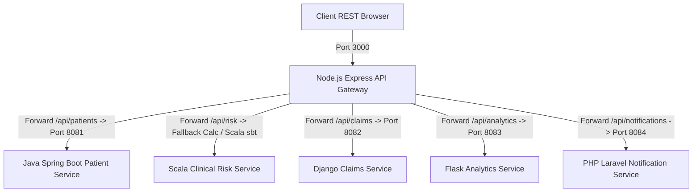
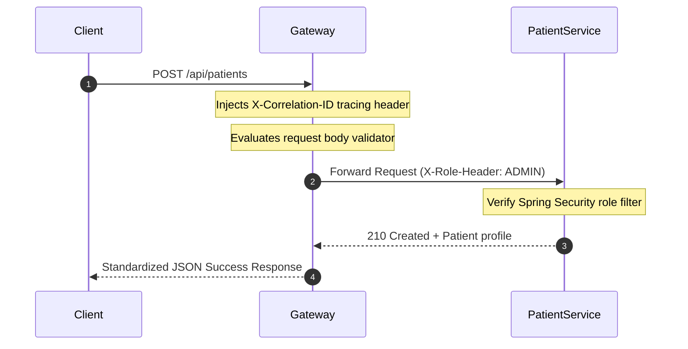
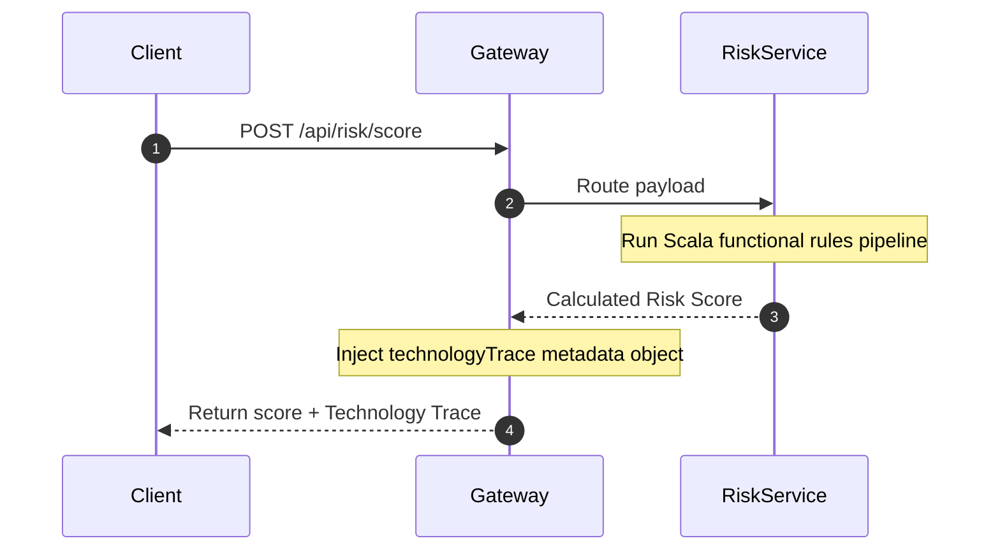

# PolyMed Engine

<div align="center">

## Live Demo

**[Click here to open the Developer Console ](https://polymed-engine.vercel.app/console)**

</div>

---

[](https://www.oracle.com/java/)
[](https://www.scala-lang.org/)
[](https://spring.io/projects/spring-boot)
[](https://nodejs.org/)
[](https://expressjs.com/)
[](https://www.djangoproject.com/)
[](https://flask.palletsprojects.com/)
[](https://www.php.net/)
[](https://laravel.com/)

## PolyMed Engine: Enterprise Healthcare Polyglot Backend Platform

PolyMed Engine is an enterprise-grade backend microservice suite designed to simulate a real-world healthcare command center. It owns core healthcare business domains (Patient profiles, claims adjudication, clinical risk rules, notifications, analytics) and visibly exposes its polyglot technology stack in real-time.


---

## 1. Executive Summary & Why PolyMed Engine Exists
Most backend portfolio projects are basic boilerplate templates. PolyMed Engine represents a real, complex production architecture built by a Senior Software Engineer. By introducing a custom-built **Technology Trace** telemetry payload, every single API request dynamically outputs which backend components handled it and why that framework was chosen.

---

## 2. Technology Visibility & "Technology Trace"
Every route processed by our API Gateway returns a `technologyTrace` metadata block:

```json
{
  "success": true,
  "message": "Patient profile registered successfully",
  "data": {
    "patientId": "pat-19028",
    "status": "ACTIVE"
  },
  "technologyTrace": {
    "action": "CREATE_PATIENT",
    "service": "Patient Management Service",
    "module": "patient-service-java-springboot",
    "technologyStack": ["Java", "Spring Boot", "Spring MVC", "Spring Security", "Hibernate"],
    "businessDomain": "Patient and Member Management",
    "whyThisStack": "This stack is used for structured enterprise healthcare APIs, role-based access, layered service design, and entity modeling.",
    "requestPath": "/api/patients",
    "architectureRole": "Domain service responsible for managing patient demographic and care team configurations."
  },
  "correlationId": "corr-1780436833512-88a3d750"
}
```

---

## 3. Technology Usage Map

| Technology | Service | Business Role | Why It Is Used | Visible In API |
| :--- | :--- | :--- | :--- | :--- |
| **Node.js** | API Gateway | Request Proxy Ingestion | Provides a non-blocking event-loop for routing and telemetry. | Yes (`/console`) |
| **Express.js** | API Gateway | Console dashboard & routing | Express middleware handles log correlation and served HTML pages. | Yes (`/console`) |
| **Java** | Patient Service | Core Patient Demographics | Strong static typing and layered architecture fit complex HIPAA maps. | Yes (`/api/patients`) |
| **Spring Security** | Patient Service | Role-Based Access controls | Restricts clinical actions by clinician, care manager, or auditor roles. | Yes (`/api/patients`) |
| **Hibernate** | Patient Service | Entity Relationship modeling | Structures patient charts, providers, care gaps and audit tables. | Yes (`/api/patients`) |
| **Scala** | Risk Service | Mathematical scoring rules | Stateless rule lists evaluate observations and metrics mathematically. | Yes (`/api/risk/score`) |
| **Django** | Claims Service | Claims approval transitions | Model workflows represent claim states (Submitted/Approved/Denied). | Yes (`/api/claims`) |
| **Flask** | Analytics Service | Dashboard aggregates | Serves dynamic KPI aggregates without unnecessary framework bloat. | Yes (`/api/analytics`) |
| **PHP / Laravel** | Notification Service | Multichannel communications | Template rendering, messagingPreferences, and delivery logs. | Yes (`/api/notifications`) |

---

## 4. Platform Architecture Diagrams

### High-Level System Architecture


### API Gateway Request Flow


### Technology Trace Flow


---

## 5. Local Run Guide

Ensure you have Node.js, Java JDK 17+, Maven, Scala sbt, Python 3.10+, and PHP installed.

### Start the API Gateway & Console
```bash
cd services/api-gateway-node-express
npm install
npm start
```
Go to **[http://localhost:3000/console](http://localhost:3000/console)** in your browser to view the live dashboard!

### Java Patient Service
```bash
cd services/patient-service-java-springboot
mvn spring-boot:run
```

### Scala Clinical Risk scoring
```bash
cd services/risk-scoring-service-scala
sbt run
```

### Django Claims Service
```bash
cd services/claims-service-django
python manage.py runserver
```

### Flask Analytics Service
```bash
cd services/analytics-service-flask
flask run
```

### Laravel Notification Service
```bash
cd services/notification-service-laravel
php artisan serve
```

---

## 6. Service Responsibility Table

| Service | Folder | Port | Business Domain | Key API Endpoints |
| :--- | :--- | :--- | :--- | :--- |
| **API Gateway** | `services/api-gateway-node-express` | `3000` | Gateway & Logging | `GET /console`, `GET /api/platform/health` |
| **Patient Service** | `services/patient-service-java-springboot` | `8081` | Patients & Audits | `POST /patients`, `GET /patients/{id}/clinical-summary`, `GET /audit-records` |
| **Risk Service** | `services/risk-scoring-service-scala` | CLI | Clinical scoring | `POST /api/risk/score`, `GET /api/risk/rules` |
| **Claims Service** | `services/claims-service-django` | `8082` | Claims workflows | `POST /claims`, `POST /claims/{id}/approve`, `GET /claim-audits` |
| **Analytics Service** | `services/analytics-service-flask` | `8083` | Analytics | `GET /analytics/dashboard-summary`, `GET /analytics/platform-kpis` |
| **Notification Service** | `services/notification-service-laravel` | `8084` | Communications | `POST /notifications`, `GET /notification-preferences/{id}` |

---

## 7. Enterprise Workflows & Security Summary
- **Onboarding Workflow**: API Gateway -> Java Patient Service. Enforces `ROLE_ADMIN` role checks and logs details inside H2 database.
- **Risk Assessment**: Stateless Scala rule pipeline evaluating biometrics, condition counts, medication compliance, and newly added age and emergency room visit rules.
- **Claims State Adjudication**: Django model instances mapping Submitted -> Under Review -> Approved or Denied transitions.
- **Multichannel Messaging**: Laravel template variables parsed to SMS/Email and checked against quiet hours preferences.

---

## 8. API Contract & Standardized Response Design

Every API endpoint across all six services follows a shared response envelope contract defined in `shared/contracts/`. This ensures that regardless of whether the response originates from Java, Python, PHP, or Scala, the client always receives a consistent structure.

**Success Response Envelope:**
```json
{
  "success": true,
  "message": "Operation completed successfully",
  "data": { },
  "technologyTrace": { },
  "correlationId": "corr-1780436833512-88a3d750"
}
```

**Error Response Envelope:**
```json
{
  "success": false,
  "error": {
    "code": "PATIENT_NOT_FOUND",
    "message": "No patient record found for the given ID.",
    "service": "patient-service-java-springboot",
    "httpStatus": 404
  },
  "correlationId": "corr-1780436833512-88a3d750"
}
```

All error codes are namespaced per service domain (e.g., `CLAIM_ALREADY_ADJUDICATED`, `RISK_SCORE_BELOW_THRESHOLD`, `NOTIFICATION_DELIVERY_FAILED`) so that the API Gateway can log and categorize failures before returning the response to the client.

---

## 9. Correlation ID Tracing & Request Lifecycle

Every inbound request to the API Gateway is assigned a unique `X-Correlation-ID` header at the middleware layer before any routing occurs. This ID is injected into every downstream service call and is returned in every response envelope, making it possible to trace a single user-initiated action across all six services.

```
Client Request
    │
    ▼
[Node.js API Gateway]
    │  Middleware: Generate X-Correlation-ID = corr-{timestamp}-{random}
    │  Middleware: Log request method, path, and correlation ID
    │
    ▼
[Downstream Service: Java / Django / Flask / Laravel / Scala]
    │  Receives X-Correlation-ID header
    │  Includes correlationId in its response payload
    │
    ▼
[API Gateway Response]
    │  Appends technologyTrace block
    │  Returns full standardized envelope to client
```

This design mirrors production-grade distributed tracing strategies used in healthcare platforms where audit trails and HIPAA-compliant logging require every action to be individually addressable.

---

## 10. Resilience & Fallback Strategy

Each service proxy in the API Gateway is built with a resilient fallback mechanism. If a downstream service is offline or unreachable, the gateway does not crash or return a 500 error. Instead, it returns a pre-defined structured mock response with full technologyTrace metadata, allowing the Developer Console and API clients to continue functioning as if the real service responded.

| Downstream Status | Gateway Behavior |
| :--- | :--- |
| Service **online** | Forwards request, returns live response |
| Service **offline / unreachable** | Returns mock JSON payload from `shared/payloads/` with `fallback: true` flag |
| Service returns **4xx** | Passes error through with standardized error envelope |
| Service returns **5xx** | Logs error, returns normalized gateway error response |

This approach allows the entire platform to be demonstrated end-to-end from the Developer Console even when only the Node.js API Gateway is running locally — a deliberate architectural decision to enable portfolio demos without requiring all six runtimes to be active simultaneously.

---

## 11. Clinical Risk Scoring Rules Engine

The Scala Risk Service evaluates patient clinical risk through a stateless, composable rules pipeline. Each rule is an independent object that accepts a patient observation payload and returns a risk contribution score. Rules are combined additively, producing a final score between 0 and 100 with a labeled risk band.

| Rule | Trigger Condition | Max Score Contribution |
| :--- | :--- | :--- |
| `ChronicConditionRule` | 2+ active chronic conditions | +25 |
| `MedicationAdherenceRule` | Adherence rate below 70% | +20 |
| `RecentHospitalizationRule` | Hospital admission in last 90 days | +20 |
| `EmergencyVisitRule` | 2+ ER visits in last 12 months | +15 |
| `CareGapRule` | Open care gaps present | +10 |
| `AgeRiskRule` | Patient age above 65 | +10 |

**Risk Band Classification:**

| Score Range | Risk Band | Recommended Action |
| :--- | :--- | :--- |
| 0 – 24 | Low Risk | Routine annual follow-up |
| 25 – 49 | Moderate Risk | Quarterly care manager outreach |
| 50 – 74 | High Risk | Monthly clinical review required |
| 75 – 100 | Critical Risk | Immediate care team escalation |

---

## 12. Future Enhancement Scope

PolyMed Engine is designed as a living backend platform. The following enhancements represent the next phase of the architecture, extending each service domain without changing the existing polyglot technology decisions.

**API Gateway — Node.js / Express.js**

The gateway currently handles correlation ID injection and request logging per call. A planned enhancement is to introduce a persistent in-memory request audit log endpoint (`GET /api/platform/request-history`) that surfaces the last N requests with their full correlation chain, upstream service target, response status, and latency in milliseconds — giving the Developer Console a live request stream view.

**Patient Service — Java / Spring Boot**

The patient domain model currently manages demographics, care teams, and care gaps. The next evolution adds a `ClinicalEncounter` entity to record structured visit histories per patient, enabling the Risk Service to evaluate encounter frequency as an additional scoring dimension alongside the existing biometric and adherence rules.

**Risk Scoring Service — Scala**

The rules engine is currently evaluated as a single-pass additive pipeline. A planned enhancement converts the pipeline to a weighted priority chain, where critical rules (recent hospitalization, emergency visit frequency) can short-circuit evaluation and immediately classify a patient as Critical Risk without summing lower-weight rules, reducing scoring latency for high-acuity cases.

**Claims Service — Django**

The claims adjudication workflow currently supports three states: Submitted, Under Review, and Approved or Denied. A planned enhancement introduces an Appeal state with its own transition rules, allowing denied claims to re-enter the review pipeline with an attached clinical justification payload routed from the Patient Service.

**Analytics Service — Flask**

The analytics dashboard currently serves aggregated KPI snapshots. A planned enhancement adds a time-series endpoint (`GET /analytics/trend`) that accepts a `metricKey` and `windowDays` parameter, returning a structured array of daily aggregate values suitable for rendering trend charts in the Developer Console without adding any charting libraries to the backend.

**Notification Service — PHP / Laravel**

The notification service currently supports SMS and Email delivery channels with quiet hours enforcement. A planned enhancement adds a delivery receipt webhook model, where each outbound notification registers a callback URL and tracks whether the delivery was confirmed, bounced, or timed out — feeding back into the Analytics Service as a communication effectiveness metric.
