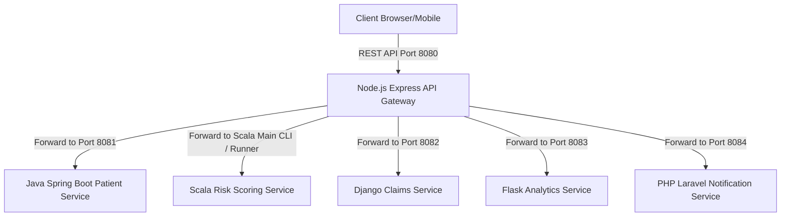

# Architecture Design

This document details the architectural principles and high-level design of the **PolyMed Engine**.

## 1. High-Level Healthcare Backend Architecture
PolyMed Engine is designed as a polyglot microservice suite where each service is responsible for a single business domain of healthcare operations.

## 2. Why Polyglot Backend Architecture?
Different services demand different programming paradigms. 
- **Java** provides the strict type safety and transaction safety needed for managing critical patient identity data.
- **Scala** enables declarative, functional rule evaluation, ensuring clinical logic contains zero side effects.
- **Node.js**'s asynchronous event loop makes it an ideal fit for routing high volumes of request traffic as an API Gateway.

## 3. Request Flow Through API Gateway
1. Gateway intercepts the HTTP request.
2. Injects a UUID correlation ID (`correlationId`).
3. Validates body parameters based on the route.
4. Forwards request downstream with the correlation ID headers preserved.
5. Receives downstream output and returns success/error format.

## 4. Cross-Service Communication Concept
In a fully deployed environment, communication between services would occur via HTTP REST calls or gRPC. In this portfolio project, we simulate cross-service dependency calls in the API gateway by orchestrating responses, showing how they chain together (e.g. creating a patient in the Patient Service, triggering a notification via Laravel, and recording risk evaluation in Flask).

## 5. Security Concept
- Role-Based Access Control (RBAC) is configured in the Spring Boot Patient Service using Spring Security filter chains.
- Routes verify permissions: Clinicians and Care Managers can access patient charts, while Auditors have exclusive access to log audit logs.

## 6. Persistence Limitation & In-Memory Mode
To comply with the strict technology limits (no MySQL, MongoDB, PostgreSQL, etc.), all services store entities in-memory using thread-safe structures (`ConcurrentHashMap` in Java, native arrays/caches in PHP, python dictionaries).

## 7. Production Extension Plan
To scale this system for production:
1. Replace in-memory repositories with JPA/Hibernate connected to PostgreSQL or MySQL.
2. Deploy Docker containers for each runtime environment.
3. Configure a real gateway reverse proxy (like NGINX or Envoy) or leverage Kubernetes ingress.
4. Implement OAuth2/OIDC via Keycloak.
