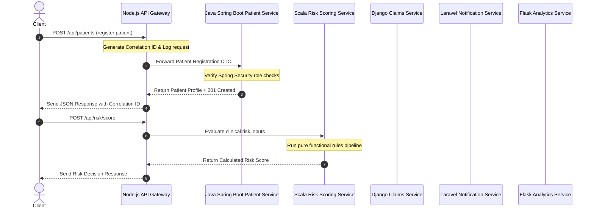

# Healthcare Request Flow

This document details the lifecycle of a request as it traverses the **PolyMed Engine** polyglot backend suite.

## Step-by-Step Flow Details

1. **Gateway Request Ingestion**: The client requests an API route on port `8080`.
   - The Gateway creates a unique `X-Correlation-ID` header.
   - It runs field validation (validators check for missing fields and type correctness).
   - It logs the incoming request info (method, path, correlation ID, timestamp).

2. **Downstream Routing & Access Control**: The gateway routes requests to the designated microservices:
   - **Java Patient Service**: Spring Security validates the roles provided in headers. Hibernate entities are updated in the repository, and audits are recorded.
   - **Scala Risk Service**: Risk assessment details are processed using stateless rules.
   - **Django Claims Service**: Validates claims and logs audit changes.
   - **Laravel Notification Service**: Triggers SMS/Email workflows based on patient settings.
   - **Flask Analytics Service**: Combines metadata to report KPIs.
